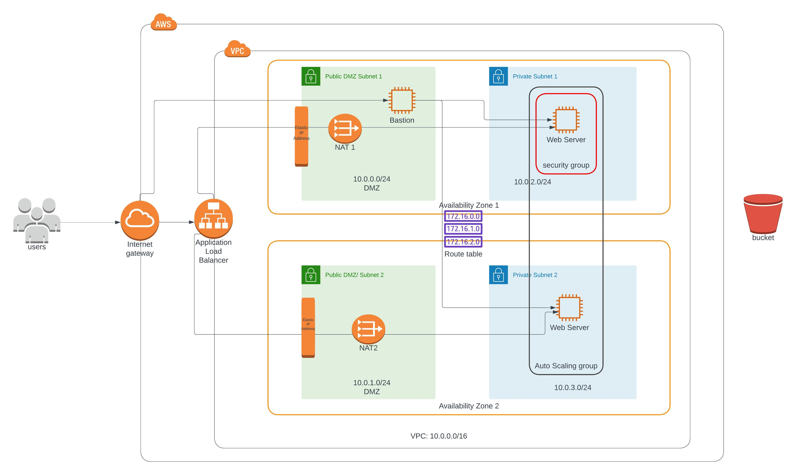

# Udagram Udacity Project 
## Deploy High Availablity web app using CloudFormation

### Project Introduction ###

As your final project, you'll be faced with a real scenario.

Creating this project will give you the hands-on experience you need to confidently talk about infrastructure as code. We have chosen a realistic scenario where you will deploy a dummy application (a sample JavaScript or HTML file) to the Apache Web Server running on an EC2 instance.

There will be two parts to this project:

* **Diagram**: You'll first develop a diagram that you can present as part of your portfolio and as a visual aid to understand the CloudFormation script.

* **Script (Template and Parameters)**: The second part is to interpret the instructions and create a matching CloudFormation script.

### The project files: ###

1. **create.sh** : This file for running the aws command to create the stack
2. **Project-Udagrram-diagram.jpeg** : This will have the architecture for the project
3. **networking.yml** : this file will configure the networking infrastructure only
4. **Project-networking.json** : this file contains all the parameters need for networking.yml
5. **servers.yml**: this file will configure the servers and jump server and related stuff
6. **Project-servers.json**: this file contains the parameters related to the servers.yml 

### The Application Diagram ###

### The Output Result ##